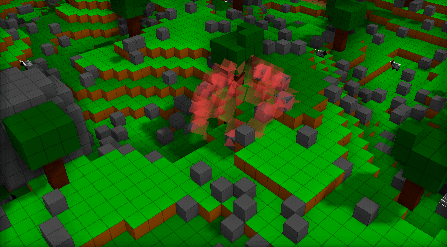
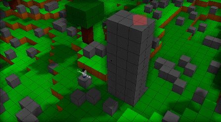

# voxel-game-engine-prototype

Main controls:

    Mouse to look, wasd to fly and shift to fly faster.

    Right click to add and left click to remove voxels.
    Scroll to change affected area size.

    To spawn (many) sheep: 1
    To spawn wolf: 2
    To spawn human: 3

    Scroll click to set target for human.

    Toggle pause npc:  - or F11 key
    Change debug mode: + or F12 key

    To enable mouse: M

    In game press tab for controls reminder.

Disclaimer:
This is my hoby project that got made into my bachelor thesis.
It has the distinct smell of a student cutting close to the deadline.
I will also include some more broad explanations on this project here also.

The main features are:
* voxel rendering through optimized meshing
* examination of different npc ai implementations
* planned destructive pathfinding

Quick summary of features.
title/image/description

# Meshing

[45, 46 meshing example, stable population gif, pathfining]

The main challenge in using polygons is figuring out how to convert the voxels into
**minimum amount of polygons efficiently**.

In a typical voxel game the voxels do not get modified that often compared to how frequently they are drawn.
Which is why the main heavy lifting happens at rendering the voxels.
As a result, it is quite sensible to optimize the mesh upfront.

No culling method has a voxel to face ratio of 6.

Clearly, in order to improve on the naive method is to simply not to draw the faces that
are obscured by checking each cubes neighbours before creating a face.

For a Perlin noise map this amounts to somewhere from 1 to 2 faces per voxel.

Improvement can be brought by merging adjacent quads together into larger regions.
While not optimal greedy implementations perform quite well.

Example of greedy meshing on a solid chunk of voxels

The idea was inspired by Karnaugh map method which is used to simplify boolean
algebra exressions.

Meshing can be improved by allowing faces to overlap and extend over undefined (culled) space as shown in next image.

Given that the material (visual) is the same, there is no z-fighting or other artifact for this approach.
There is no rule that faces can not intersect.

To begin, every chunk with n**3 voxels has 3(n+1) planes where faces are drawn as seen on 8x8x8 chunk above.
While sharing polygons is a proven viable idea,
all voxel faces on a plane can be drawn with a single polygon where the polygon’s texture pixels are the faces.
So if at least 1 face exists on a plane there has to be at least one polygon.
This would hint that polygon-wise this would be the optimal solution for the least amount of polygons possible.

# Pathfinding in voxel games different

There is inherent expectation of the world's capability to perform alteration.
Like the user is able to manipulate the state of the world also the inhabiting actors must meet the same expectations.
This means that the pathfinding not only has to traverse nodes but also be able to alter the state of the world.
By bringing this new dimension of complexity to the pathfinding problem the prospect of finding the optimal path becomes seemingly unreachable.

This algorithm follows the A* pathfinding pattern. The main change to the algorithm is
the added functionality for passing through solid voxels where the travel cost is
calculated with the necessary changes in mind.

# Extra
Pseudo-random pathfinding.

Simplest would be the Brownian motion inspired pathfinding.
If one can offset the probability of the vectors appearing by some dynamic function the resulting biased motion or drift
will try to reach the direction.
If the motion to the direction of the target is more probable, it may get there eventually.

Dispersion of sheep from danger and competition

This is great for simulationg large set of npc to convey a sense of activity in the world.

Wolfs

# Soon

